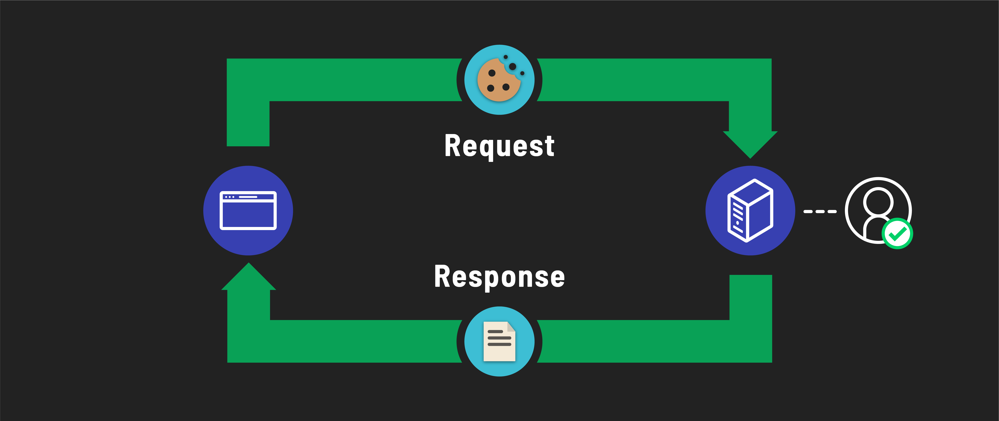
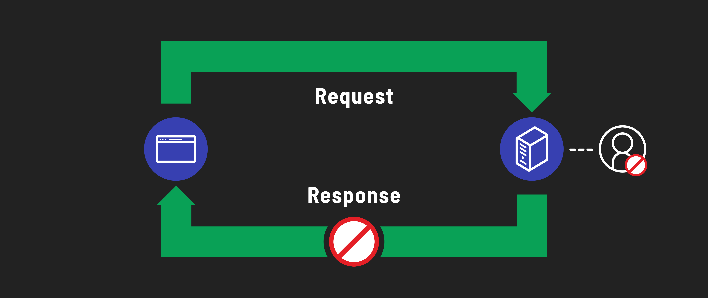

<h1>
  <span class="headline">MEN Stack Session Auth</span>
  <span class="subhead">Sign Users In</span>
</h1>

**Learning objective:** By the end of this lesson, students will be able to implement sign in functionality with sessions in a sign in route.

In this section, we'll navigate through the sign-in process on our server. This begins when a user submits their credentials, triggering a `POST` request to the `/sign-in` route. 

## Define the route

Once a user submits their request from the sign in page, we need a route set up to handle this request. Let's start with the simplest, testable version of this route, so we can immediately confirm a working form submission

Add the following in `controllers/auth.js`:

```javascript
router.post("/sign-in", async (req, res) => {
  res.send("Request to sign in received!");
});
```

## Confirming a `User` exists

First, we need to grab the user from the database, using the username provided in the form. If there is no such user, we have our first failure condition, and can send back an appropriate response. For security reasons, we will recycle the same, vague message for all sign in failures, so that a prospective hacker won't have any clues about what exactly is failing.

Add the following inside the route handler function:

```javascript
const userInDatabase = await User.findOne({ username: req.body.username });
if (!userInDatabase) {
  return res.send("Login failed. Please try again.");
}
```

## `Bcrypt`'s comparison function

Inside this route, we will again rely on `bcrypt` to determine if the entered password matches the one stored in the database. The `bcrypt` library has a `compareSync`  method to check if the plain-text password entered by the user matches the hashed password in the database. It hashes the user's input with the same method used for the stored password and compares the two hashes. This method returns a `true` or `false` response based on whether the passwords match. If the result is `false`, we send the same failure message as before.

Add the following beneath the previous validation:

```javascript
const validPassword = bcrypt.compareSync(
  req.body.password,
  userInDatabase.password
);
if (!validPassword) {
  return res.send("Login failed. Please try again.");
}
```

## Session-based authentication

If the route handler function has gotten this far, it means we have a successful attempt to sign in to the application. Great! Now what?

There are various methods to manage signed-in users in applications. For ours, we've chosen to implement a ***session-based*** authentication strategy.


Let's talk about `cookies`, which are central to this approach. `Cookies` are small pieces of data stored on your browser. You've likely encountered numerous websites asking if you're okay with them using `cookies`. Originally, these were widely employed by advertisers to track your activity across the internet and even shared across companies in a vast conspiracy of targeted ads.

But `cookies` have their good sides too. They're what allow e-commerce sites to remember what’s in your shopping cart, even if you accidentally close the tab or browse away.


Now, the catch with `cookies` is that they reside in the browser, making everything in them accessible to the user. That's why we cant store sensitive data like passwords in `cookies` — the front-end isn't secure.

In our **session-based** strategy, however, we use `cookies` differently. They'll hold encrypted information about the signed-in user, which only our server can decrypt. This encrypted information forms a `session`.

When a user signs into our application, they start a `session` that marks them as authenticated. 


Future requests from this user will carry this `session` in their browser cookie. Our server reads this `session` to verify if the request is from a signed-in user and, if so, identify who that user is.



If a request is made to a protected route without this `session`, the server responds with an error message.



## Setting up sessions in our server

Sessions are another part of authentication best left to established third party libraries. So we'll need a new package to use sessions in our express application:

```bash
npm i express-session
```

Since we're encrypting and decrypting information from a `session` object, we'll need to create a new environment variable called  `SESSION_SECRET` that is used in the encrypting and decrypting process. We need to keep this string secure, or else anyone would be able to decrypt and read the information stored in the `session`.

Add a `SESSION_SECRET` variable to your `.env` file:

```plaintext
SESSION_SECRET=secret-string-unique-to-your-app
```

This string can be anything you want.

## Managing sessions

Every time a user accesses a route in our application, we'll likely need to perform actions related to their `session`, which sounds like a great case for middleware! 
This middleware will automatically manage session data for each user request, ensuring a seamless and secure user experience throughout our application.

Before you can use session management in your Express app, you need to include the express-session module. Add the following line at the top of your `server.js` file, right after your other require statements:

```js
const session = require('express-session');
```

Then add the following in `server.js` at the bottom of our middleware stack:

```javascript
app.use(methodOverride("_method"));
app.use(morgan('dev'));
// new
app.use(
  session({
    secret: process.env.SESSION_SECRET,
    resave: false,
    saveUninitialized: true,
  })
);
```

This code integrates session management into our application using the `express-session` library. It configures the session middleware to securely manage user sessions with a secret key, specifies not to resave sessions that haven't changed, and allows for storing new, uninitialized sessions. 


## Creating a session for a signed-in user

Now that we've set up our session middleware, we can finalize the sign-in route in our route handler. After a user's request successfully passes the initial validations, our next step is to establish a new session for them. This involves storing their username in the session. By doing so, we can identify and authenticate the user for their future requests to our application.

With the addition of our middleware, a `session` object has been attached to all incoming requests, so we can access it in routes through the `req` object directly:

```javascript
req.session.user = {
  username: userInDatabase.username,
};
```

This code sets the user retrieved from the database as the user in the newly created session. 

Once that's done, we can simply redirect them back to the landing page for now.

```javascript
res.redirect("/");
```

## Full route handler

To recap, here's what your full route handler function should look like:

```javascript
router.post("/sign-in", async (req, res) => {
  // First, get the user from the database
  const userInDatabase = await User.findOne({ username: req.body.username });
  if (!userInDatabase) {
    return res.send("Login failed. Please try again.");
  }

  // There is a user! Time to test their password with bcrypt
  const validPassword = bcrypt.compareSync(
    req.body.password,
    userInDatabase.password
  );
  if (!validPassword) {
    return res.send("Login failed. Please try again.");
  }

  // There is a user AND they had the correct password. Time to make a session!
  // Avoid storing the password, even in hashed format, in the session
  // If there is other data you want to save to `req.session.user`, do so here!
  req.session.user = {
    username: userInDatabase.username,
    _id: userInDatabase._id
  };

  res.redirect("/");
});
```

## Modify the landing page and `index` route

To test the functionality of user sign-in, we need to update our landing page to reflect the user's sign-in status. This is done by utilizing the `req.session` object, which is now attached to every request due to our `session` middleware.

Here's how we'll do this:

- In our landing page's route, we're going to send a `user` variable to our `index.ejs` template. This variable is assigned the value of `req.session.user`, a property we just set during the sign-in process.

- If `user` is `undefined` (which happens `when req.session.user` is not set), it means the visitor isn't signed in. In this case, our template will treat them as a guest, showing options to sign up or sign in.

- If `user` has a value (meaning `req.session.user` is set), the visitor is recognized as a signed-in user. We can then personalize their greeting and omit the sign-up and sign-in links, as they're already authenticated.


First, we'll change the route in `server.js` to the following:

```javascript
app.get("/", (req, res) => {
  res.render("index.ejs", {
    user: req.session.user,
  });
});
```

Then, we can add some logic to the `index.ejs` template, like so:

```html
<% if (user) { %>
<h1>Welcome to the app, <%= user.username %>!</h1>
<% } else { %>
<h1>Welcome to the app, guest.</h1>
<p>
  <a href="/auth/sign-up">Sign up</a> or <a href="/auth/sign-in">sign in</a>.
</p>
<% } %>
```

## Test sign in

You should now be able to test all of this functionality through the application directly. Failed sign in attempts should simply result in a message shown in the browser, and require you to navigate back to the sign in page. A successful sign in should result in seeing the landing page again, with a personalized greeting.

Note, however, that any time you restart the server, the version of the session object being stored in the server's memory will be deleted, and it will be as though you never signed in! If you make any modifications that restart the server, you will have to sign in all over again.

If you get annoyed enough by this during your development process, we have a solution to store the sessions in MongoDB, instead of the server's local memory, in the level up section of this module.

<!-- [Starter Code](https://git.generalassemb.ly/modular-curriculum-all-courses/men-stack-session-auth-template/tree/sign-the-user-in-start)

[Complete Code](https://git.generalassemb.ly/modular-curriculum-all-courses/men-stack-session-auth-template/tree/sign-the-user-in-complete) -->
